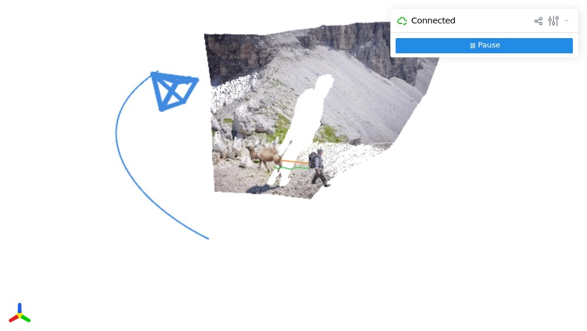
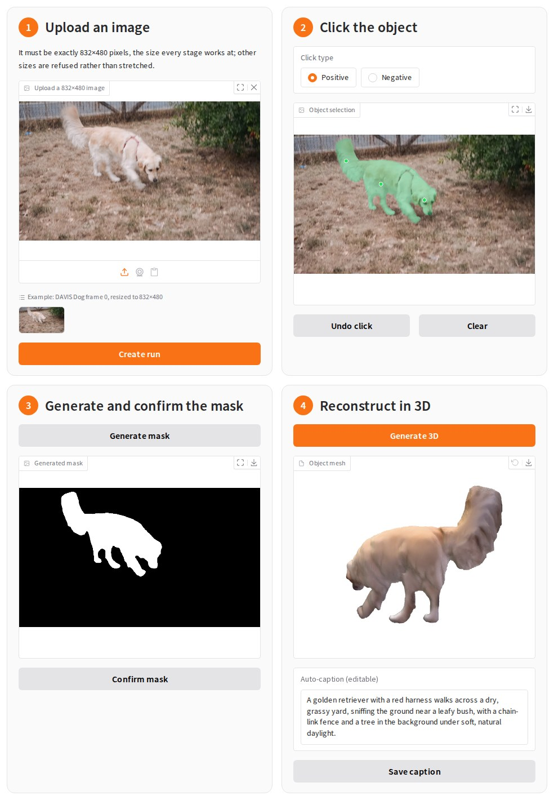
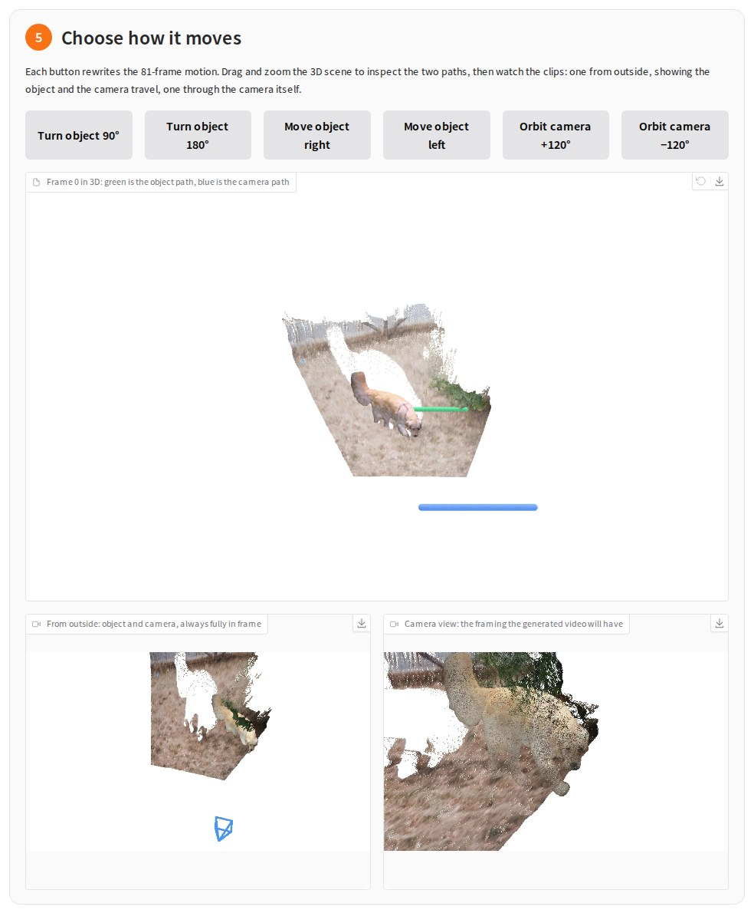

<p align="center"></p>

<h1 align="center">4Director: Controlling Video World Models with Rigid&nbsp;3D&nbsp;Geometry</h1>

<p align="center">
  <a href="https://arxiv.org/abs/2610.02160"></a>
  <a href="https://stability-ai.github.io/4director/"></a>
</p>

<p align="center">⭐ If you find 4Director useful, please give this repo a star. Thank you!</p>

<p align="center">
<a href="https://vveicao.github.io/">Wei Cao</a><sup>1,2</sup>&nbsp;&nbsp;
<a href="https://haoz19.github.io/">Hao Zhang</a><sup>2</sup>&nbsp;&nbsp;
<a href="https://voletiv.github.io/">Vikram Voleti</a><sup>1</sup>&nbsp;&nbsp;
<a href="https://yuqunw.github.io/">Yuqun Wu</a><sup>2,1</sup>&nbsp;&nbsp;
<a href="https://scholar.google.com/citations?user=NlAB4EsAAAAJ">Mallikarjun B R</a><sup>1</sup>&nbsp;&nbsp;
<a href="https://scholar.google.com/citations?user=aX-ruVYAAAAJ">Shimon Vainer</a><sup>1</sup>&nbsp;&nbsp;
<a href="https://markboss.me/">Mark Boss</a><sup>1</sup>&nbsp;&nbsp;
<a href="https://yaoyaoliu.web.illinois.edu/">Yaoyao Liu</a><sup>2</sup>
</p>

<p align="center">
<sup>1</sup>Stability AI&nbsp;&nbsp;&nbsp;&nbsp;
<sup>2</sup>University of Illinois at Urbana-Champaign
</p>

<p align="center">
<a href="https://stability.ai/"><picture><source media="(prefers-color-scheme: dark)" srcset="assets/stability-ai-dark.svg"></picture></a>
&nbsp;&nbsp;&nbsp;&nbsp;&nbsp;&nbsp;&nbsp;&nbsp;
<a href="https://illinois.edu/"><picture><source media="(prefers-color-scheme: dark)" srcset="assets/uiuc-dark.svg"></picture></a>
</p>

<p align="center">
 <b>Object&nbsp;control</b>
&nbsp;&nbsp;&nbsp;&nbsp;
 <b>New&nbsp;object&nbsp;insertion</b>
&nbsp;&nbsp;&nbsp;&nbsp;
 <b>Camera&nbsp;control</b>
</p>

**TL;DR:** A video world model conditioned on an explicit 4D scene
representation, giving direct 3D control over camera and multi-object motion.
One input image becomes an editable 4D scene, and every control below is a rigid
3D transform applied inside that scene.

<div align="center">
<table>
<tr>
<td align="center"><br><sub><b>Input image</b></sub></td>
<td align="center"><br><sub><b>New object reference</b></sub></td>
</tr>
</table>
</div>

<table>
<tr>
<th align="center">Controls</th>
<th align="center">Scene point cloud —   to orbit</th>
<th align="center">Generated video</th>
</tr>
<tr>
<td align="center">
</td>
<td align="center"><a href="https://vveicao.github.io/projects/4director/viser-client/?playbackPath=../assets/object-motion.viser"></a></td>
<td align="center"></td>
</tr>
<tr>
<td align="center">

</td>
<td align="center"><a href="https://vveicao.github.io/projects/4director/viser-client/?playbackPath=../assets/object-insertion.viser"></a></td>
<td align="center"></td>
</tr>
<tr>
<td align="center">

<br>
</td>
<td align="center"><a href="https://vveicao.github.io/projects/4director/viser-client/?playbackPath=../assets/joint-camera.viser"></a></td>
<td align="center"></td>
</tr>
</table>

## Installation

Validated on Linux with NVIDIA H200 GPUs. The whole pipeline runs on one GPU
with at least 80 GB of memory, and the weights and model caches take about
110 GB of disk.

The environment pins **Python 3.11 + PyTorch 2.7.1 + xformers 0.0.31.post1 +
CUDA 12.8 (cu128 wheels) + cuDNN 9.13.1**, so the NVIDIA driver must support
CUDA 12.8.
Compiling the extensions also needs the **CUDA 12.8 toolkit** (`nvcc` 12.8; a
13.x toolkit does not work). `install_extensions.sh` uses `$CUDA_HOME` if it is
set, else `/usr/local/cuda-12.8`, else the `nvcc` on `PATH`.

### Step 1 — Create the environment

```bash
# Clone the repository and its submodules.
git clone --recurse-submodules https://github.com/VVeiCao/4Director.git
cd 4Director
# Cloned without --recurse-submodules? Fetch them now:
# git submodule update --init --recursive

# Create the conda environment and install 4Director.
conda env create -f environments/4director.yml
conda activate 4director
pip install -e '.[ui]'

# Build PyTorch3D, Pixal3D's CUDA extensions, and MegaSAM, and add cuDNN 9.13.1 (needs a GPU and the CUDA 12.8 toolkit).
bash environments/install_extensions.sh
```

### Step 2 — Download the weights

```bash
# SAM 2, Wan2.1-VACE-14B, and the 4Director Motion Adapter, into ./models.
python download_models.py
```

The app's first **Generate 3D** also fetches MoGe-2, UniDepth, Qwen3-VL, and
Pixal3D, about 31 GB, into `./models/cache`. If some weights already live
elsewhere, copy `components.env.example` to `components.env` and point it at
them; shell exports of those names are ignored.

## Reproduce the Teaser Cases

```bash
# Generate the three teaser videos into output/<case>/output.mp4.
python run.py --config configs/cases/object-motion.yaml     # Hiker
python run.py --config configs/cases/object-insertion.yaml  # Hiker + Camel
python run.py --config configs/cases/joint-camera.yaml      # Hiker + Camel + camera
```

```bash
# Play a Case in 3D at http://localhost:8080: the point cloud, with the objects and camera moving along their paths.
python run.py viser --config configs/cases/joint-camera.yaml
```

<p align="center">
  
</p>

## Generate from a Single Image

### Step 1 — Build the 3D scene

```bash
python apps/frame0_gradio.py --port 7860
```

Open `http://localhost:7860`; the terminal lists anything the app cannot find
yet. On a remote GPU machine, forward the port first
(`ssh -L 7860:localhost:7860 <host>`), and port 8080 the same way for Viser.

<p align="center">
  
</p>

1. **Upload an 832×480 image**, or keep the golden retriever example. Other
   sizes are refused rather than stretched.
2. **Click the subject** to move. Negative clicks remove anything SAM2 picks up
   by mistake.
3. **Generate the mask** and confirm it. Nothing expensive runs before this.
4. **Generate 3D** builds the object mesh, the background point cloud, and an
   editable caption.

### Step 2 — Choose the motion

<p align="center">
  
</p>

Pick one of six motions (turn or move the object, or orbit the camera) and
preview it before generating.

### Step 3 — Render and generate the video

Run the two commands printed at the bottom of the page:

```bash
# Render the depth control for the chosen motion.
python run.py stage3 --config output/frame0-demo/<run-id>/case.yaml \
    --run-root output/frame0-demo/<run-id> --force

# Generate the video into output/frame0-demo/<run-id>/output-seed123.mp4.
python run.py stage4 --config output/frame0-demo/<run-id>/case.yaml \
    --run-root output/frame0-demo/<run-id> --checkpoint models/4Director/step-2610.safetensors \
    --seed 123 --force
```

If a video looks off, rerun only the second command with another `--seed`;
each seed writes its own `output-seed<seed>.mp4`, and the control does not
depend on it. Runs are saved under `output/frame0-demo/` and can be reopened,
mask, mesh, and caption included, from the list at the top of the page.

## License and Attribution

The code and model weights are released under the
[Stability AI Community License](LICENSE.md): free for research, non-commercial, and commercial use by
organizations and individuals with annual revenue up to US $1,000,000. Above that, commercial use needs
an [Enterprise License](https://stability.ai/enterprise) from Stability AI. See the
[Hugging Face model card](https://huggingface.co/vveicao/4Director) for details.

The Git submodules under `third_party/`, the extensions `install_extensions.sh`
builds, and the models downloaded at run time keep their own licenses. Three of
them allow research and other non-commercial use only: UniDepth (CC BY-NC 4.0),
which builds the scene point cloud, and nvdiffrast and nvdiffrec (NVIDIA Source
Code License), which Pixal3D renders with. Reproducing the teaser Cases runs none
of them; building a new scene or object mesh does. Pixal3D's DINOv3 encoder comes
under the [DINOv3 License](https://huggingface.co/camenduru/dinov3-vitl16-pretrain-lvd1689m/blob/main/LICENSE.md).

## Citation

If you find 4Director useful, please cite:

```bibtex
@misc{cao20264directorcontrollingvideoworld,
  title={4Director: Controlling Video World Models with Rigid 3D Geometry},
  author={Wei Cao and Hao Zhang and Vikram Voleti and Yuqun Wu and Mallikarjun B R and Shimon Vainer and Mark Boss and Yaoyao Liu},
  year={2026},
  eprint={2610.02160},
  archivePrefix={arXiv},
  primaryClass={cs.CV},
  url={https://arxiv.org/abs/2610.02160},
}
```

## Acknowledgements

We thank the authors of
[Wan2.1](https://github.com/Wan-Video/Wan2.1),
[VACE](https://github.com/ali-vilab/VACE),
[DiffSynth-Studio](https://github.com/modelscope/DiffSynth-Studio),
[MegaSaM](https://github.com/mega-sam/mega-sam),
[MoGe-2](https://github.com/microsoft/MoGe),
[UniDepthV2](https://github.com/lpiccinelli-eth/UniDepth),
[Pixal3D](https://github.com/TencentARC/Pixal3D),
[TRELLIS.2](https://github.com/microsoft/TRELLIS.2),
[TAPIP3D](https://github.com/zbw001/TAPIP3D),
[SAM 2](https://github.com/facebookresearch/sam2),
[SAM 3](https://github.com/facebookresearch/sam3),
[Qwen3-VL](https://github.com/QwenLM/Qwen3-VL),
[PyTorch3D](https://github.com/facebookresearch/pytorch3d),
[Viser](https://github.com/nerfstudio-project/viser),
[RealCOD-25K](https://github.com/grenoble-zhang/SymphoMotion), and
[DAVIS](https://davischallenge.org/)
for releasing their code, models, and data.
